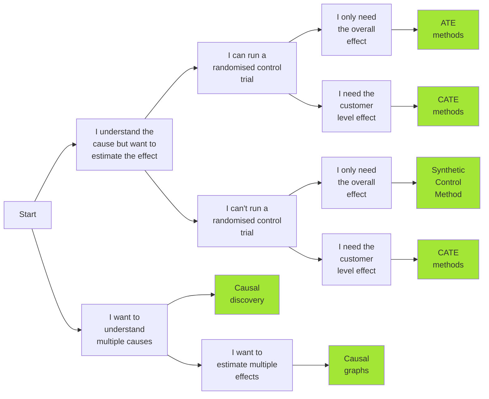

# Causal AI
This project introduces Causal AI and how it can drive business value.

The code found in the notebooks folder was used to help write my series of articles on Towards Data Science:

[Articles](https://medium.com/@raz1470)

## Technical term glossary

| Term                                 | Definition |
|--------------------------------------|------------|
| ATE (average treatment effect)       | The average difference in the outcome between treated and untreated groups. |
| Backdoor criterion                   | A method for identifying and controlling for confounders to estimate the causal  effect, typically by blocking all backdoor paths. |
| CATE (conditional average treatment effect) | The ATE for specific subpopulations defined by certain characteristics. |
| Colliders                            | A variable that is influenced by two or more other variables in a causal graph. |
| Confounder/Confounding               | A variable that is related to both the treatment and the outcome, potentially  biasing the estimated effect of the treatment. |
| Confounding bias                     | The bias in the estimated treatment effect caused by the presence of confounders. |
| Conditional independence             | A situation where two variables are independent given the value of a third variable. |
| Counterfactuals                      | The hypothetical scenario representing what would have happened if the  treatment/intervention had not been applied. |
| DAG (directed acyclic graph)         | A graphical representation of a set of variables and their causal relationships,  depicted with directed edges and no cycles. |
| Experimental data                    | Data collected from a randomized experiment where the treatment is randomly assigned. |
| Frontdoor criterion                  | A method using a mediator to estimate the causal effect of a treatment on an outcome. |
| Heterogeneous treatment effects      | Variations in treatment effects across different subgroups within a population. |
| ITE (individual treatment effect)    | The effect of treatment on an individual entity. |
| IV (instrumental variable)           | A variable that affects the treatment but not the outcome directly, used to estimate  causal effects when there are confounders. |
| Mediators                            | A variable that lies on the causal path between the treatment and the outcome. |
| Observational data                   | Data collected without random assignment of the treatment. |
| Outcome                              | The metric we are trying to measure a change in as a result of an intervention. |
| Pearl's do-calculus                  | A set of rules developed by Judea Pearl to derive causal effects from observational  data using a DAG. |
| Propensity score                     | The probability of a unit receiving the treatment given its observed characteristics,  used to control for confounding in observational studies. |
| Randomized Controlled Trial (RCT)    | An experimental design where subjects are randomly assigned to treatment or control  groups to measure the effect of the treatment. |
| Selection bias                       | Bias that arises when the sample is not representative of the population,  affecting the validity of conclusions. |
| Spurious correlation                 | A correlation between two variables that is not due to any direct causal relationship. |
| Structural Equation Modeling (SEM)   | A statistical technique that allows for the modeling of complex relationships among  variables, including both direct and indirect effects. |
| Treatment/Intervention               | A change or action designed to affect the outcome. |
| Unconfoundedness                     | The assumption that all confounders have been identified and accounted for. |

## Business problem -> causal solution map

Trying to map business problems to causal solutions can easily become overwhelming… The following mapping will help you find your way:

