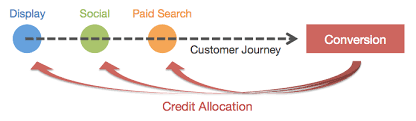
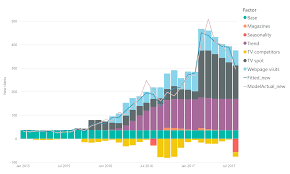
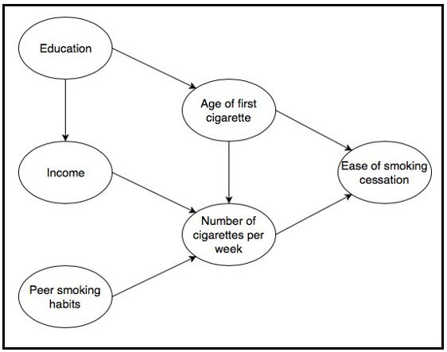

# Marketing effectiveness
Each year, organisations invest heavily in marketing which is intended to acquire new customers. Understanding the return on investment at a channel level can help them increase profitability. Several approaches have been proposed over the years for assessing marketing effectiveness, each with its limitations (e.g. multi-touch attribution, marketing mix modelling). This project aims to explore whether causal graphs are a more suitable approach.

# Current approaches and limitations

**Multi-touch attribution** - This approach collects digital touchpoints for prospects who did and didn't sign up. Signups are attributed across the digital touchpoints that led up to it. There are a number of approaches which have been proposed for determining how to attribute signups across the digital touchpoints - However, how suitable these are is irrelevant due to the following major data challenges:
- We can only track digital touchpoints - the influence of offline channels like TV, Radio, Print, OOH are missing
- We can only track digital touchpoints where a customer has clicked through to the website - meaning we underestimate the influence of brand digital channel which don't have a direct call to action
- Linking digital touchpoints together relies on cookies - this often means we can only see a customers digital touchpoints 24 hours prior to signup

**Marketing mix modelling** - This approach collects aggregated exposure (spend, impressions, clicks) and response (signups) data and a regression model is used to determine how the exposure data (features) contributes to the response (target). Using aggregated data removes the challenges faced by multi-touch attribution. However, linear regression and more advanced ML approaches do not represent the known data-generating-process:
- TV and brand digital driving an increase in paid and organic search clicks 
- Increasing paid search brand spend having a negative effect on organic search clicks 
- The confounding effect of demand

# What are causal graphs?
A causal graph is a graphical representation that reflects the causal relationships between different variables in a system.

**Causal Discovery**: The aim is to determine the graph (also known as DAG) - which variables are causally linked and in which direction? This is a heavily researched area academically with a range of proposed solutions. It's unclear what solution is best and results are often inconsistent. The level of success is often driven by how much expert domain knowledge was incorporated into the graph before running causal discovery algorithms.

**Structural Causal Model (SCM)**: Given a graph and observed data, a model can be trained to understand the relationships between variables. This is known as a structure causal model. Simplistically an SCM is a series of models, one per node - each node is a target in a model, and it's parents are features. 

**Counterfactuals & Interventions**: An SCM is a powerful tool which can be used to calculate counterfactuals (what would have happened in the absence of an action?) and simulate interventions (if I change this action, how will it affect downstream outcomes). 

# Why are causal graphs suited to assessing marketing effectiveness?
There are 4 main things that mean causal graphs lend themself nicely to assessing marketing effectiveness:
1) They can capture the data-generating-process which marketing mix modelling can't
2) We have strong domain knowledge of the causal graph, so we don't have to worry about the inconsistent results of causal discovery
3) Being able to calculate counterfactuals enables us to assess what would have happened if we had turned off each channel one at a time - this can be used to determine how much each channel is contributing to signups
4) Being able to simulate interventions enables us to assess scenarios like "what is the downstream impact of increasing TV spend by 20% in terms of other channel clicks and sign-ups?"

ADD DIAGRAM

# Project contents
The following areas are covered:

| Objective | Link | 
| --------- | ---- |
| Are causal graphs a suitable approach to assessing marketing effectiveness? | NOTEBOOK LINK |

# Installing the virtual environment
If you want to clone this repo and run the notebooks locally install the dependencies using:
`. venv/Scripts/activate`

And then run:
`pip install -r requirements.txt`

# Additional resources
The following resources may be useful:

| Resource        | Link | 
| ---------------- | ---- |
| Marketing effectiveness | RESOURCE LINK |
| Multi-touch attribution | RESOURCE LINK |
| Marketing mix modelling | RESOURCE LINK |
| Causal graphs | RESOURCE LINK |
| dowhy.gcm python package | [Documentation](https://www.pywhy.org/dowhy/v0.8/user_guide/gcm_based_inference/index.html) |
